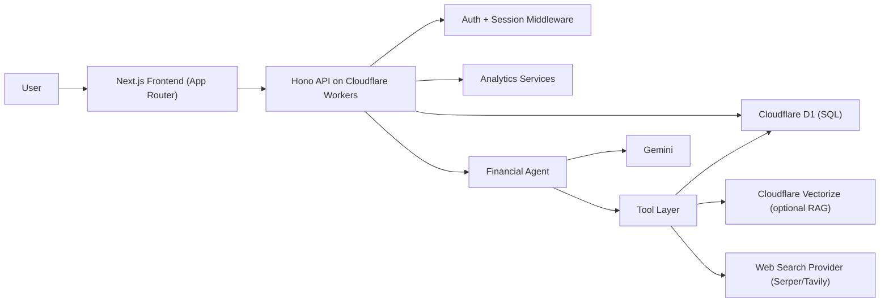

# BurryAI

AI-first personal finance copilot focused on students and early-career users.

BurryAI combines real financial tracking (income, expenses, loans), deterministic analytics, and an agentic advisor pipeline to deliver practical recommendations such as spending control, debt optimization, and income opportunities.

## Why BurryAI

- Most budgeting tools only visualize data; BurryAI also explains what to do next.
- AI responses are grounded with user data + financial logic + retrieval, not only free-form chat.
- Cloudflare-native architecture keeps latency low and the deployment model simple.

## Core Product Capabilities

- **Overview Dashboard**: total income, expenses, loan commitments, health score, charts, and projections.
- **AI Advisor**: personalized guidance based on your profile, spending trends, and goals.
- **Cost Cutter**: identifies avoidable spending and high-impact optimization actions.
- **Timeline**: upcoming financial events and repayment checkpoints.
- **Profile + Onboarding**: user setup and financial context required for accurate recommendations.
- **Guest mode**: lets users explore the app before creating an account.

## Architecture



## Tech Stack

- **Frontend**: Next.js 14, React 18, TypeScript, Tailwind CSS
- **Backend**: Cloudflare Workers, Hono, Zod
- **Database**: Cloudflare D1 (SQLite-compatible)
- **AI**: Gemini, tool-based agent pipeline, optional Vectorize RAG
- **Charts/UI**: Recharts + custom dashboard components

## Repository Structure

```text
burryai/
  app/                  # Next.js App Router pages
  components/           # UI and dashboard components
  contexts/             # React contexts (auth, app state)
  lib/                  # Frontend data clients and utilities
  burryai-worker/       # Cloudflare Worker API (Hono routes/services)
  workers/migrations/   # D1 SQL migrations
  .github/workflows/    # CI/CD pipelines
```

## How It Works

1. User authenticates (or starts in guest mode).
2. Onboarding captures financial context.
3. Dashboard and feature pages call `/api/*` endpoints (rewritten to Worker API).
4. Worker computes deterministic metrics from D1.
5. AI advisor combines metrics, profile context, and retrieval tools to generate guidance.
6. Interactions are logged for traceability and product analytics.

## API Surface (High-Level)

Base path in local frontend usage: `/api/*` (proxied to Worker).

- **Health/ops**
  - `GET /health`
  - `GET /metrics`
- **Auth**
  - `POST /auth/signup`
  - `POST /auth/login`
  - `POST /auth/logout`
  - `GET /auth/me`
- **Financial data**
  - `GET/POST /expenses`
  - `GET/POST /loans`
  - `GET/PUT /profile`
  - `GET /financial-summary`
- **Dashboard**
  - `GET /dashboard/expense-summary`
  - `GET /dashboard/financial-score`
  - `GET /dashboard/charts`
  - `GET /dashboard/timeline`
- **AI**
  - `POST /agent/advice`

Most routes are also exposed with `/api/...` aliases directly in the Worker for compatibility.

## Database Model (D1)

Primary tables:

- `users`
- `financial_profiles`
- `user_profiles`
- `expenses`
- `loans`
- `ai_logs`
- `financial_scores`
- `recommendations`

Migrations are in `workers/migrations` and are applied through Wrangler.

## Local Development

### Prerequisites

- Node.js 18+
- npm 9+
- Cloudflare account + Wrangler CLI access (`npx wrangler login`)

### Install

```bash
npm install
```

### Run Frontend + Worker Together

```bash
npm run dev:all
```

This starts:

- Frontend: `http://localhost:3000`
- Worker API: `http://127.0.0.1:8787`

`dev:all` clears both ports before startup to avoid `EADDRINUSE`.

### Useful Commands

```bash
# Frontend only
npm run dev:web

# Worker only (local)
npm run dev:worker:local

# Lint frontend
npm run lint

# Worker tests
npm run test --prefix burryai-worker

# Apply D1 migrations locally
npm run d1:migrate:local
```

## Configuration

### Frontend Environment

- `WORKER_API_BASE_URL` (server-side rewrite target)
- `NEXT_PUBLIC_WORKER_API_BASE_URL` (client-side API base override)
- `NEXT_PUBLIC_API_BASE_URL` (optional direct API base for specific environments)
- `NEXT_PUBLIC_USE_DIRECT_WORKER_API=true` (optional, bypasses rewrite strategy)

### Worker Secrets / Vars

- `JWT_SECRET`
- `GEMINI_API_KEY` (recommended)
- `SERPER_API_KEY` or `TAVILY_API_KEY` (for web retrieval)
- `ENABLE_VECTORIZE_RAG` (`true/false`)
- `EMBEDDING_MODEL` (default: `@cf/baai/bge-base-en-v1.5`)
- `WEB_SEARCH_PROVIDER` (`serper` by default in config)

## Deployment

Deployment target is Cloudflare-native:

- **Frontend**: Cloudflare Workers via OpenNext (`wrangler.frontend.jsonc`)
- **API**: Cloudflare Worker (`burryai-worker`)
- **Database**: Cloudflare D1

### CI/CD

Pushes to `main` trigger deployment via `.github/workflows/deploy-cloudflare.yml`.

Required repository secrets:

- `CLOUDFLARE_API_TOKEN`
- `CLOUDFLARE_ACCOUNT_ID`
- `D1_DATABASE_ID`
- `JWT_SECRET`
- `GEMINI_API_KEY` (recommended)
- `TAVILY_API_KEY` or `SERPER_API_KEY` (optional based on provider)

## Vectorize / RAG Setup (Optional Production Path)

```bash
npx wrangler vectorize create financial-data --dimensions=768 --metric=cosine
npx wrangler vectorize info financial-data
```

Then set:

- `ENABLE_VECTORIZE_RAG=true`
- `EMBEDDING_MODEL=@cf/baai/bge-base-en-v1.5`

and redeploy the worker.

## Security Notes

- Keep API keys and JWT secrets in Worker secrets, never in frontend source.
- Auth uses session-based flows with user-scoped access patterns in database queries.
- Avoid committing `.env.local` or any credential files.

## Product Roadmap

- Smarter proactive alerts and anomaly detection
- Better subscription/waste detection in Cost Cutter
- Scenario simulations for student loan strategies
- Improved explainability and source citations in advisor responses

## Contributing

Contributions are welcome. Recommended process:

1. Fork the repository
2. Create a feature branch
3. Keep commits focused and testable
4. Run lint/tests before opening a PR
5. Open a pull request with implementation notes and screenshots (if UI changes)

For system-level roadmap details, see `IMPLEMENTATION.md`.