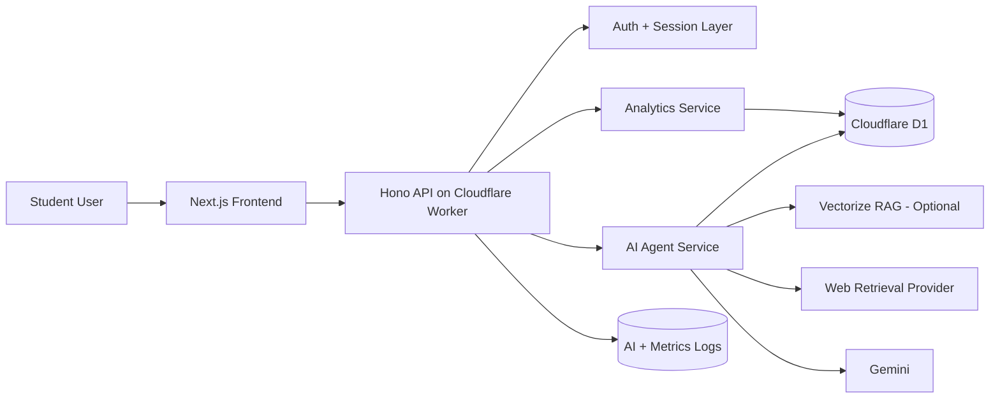
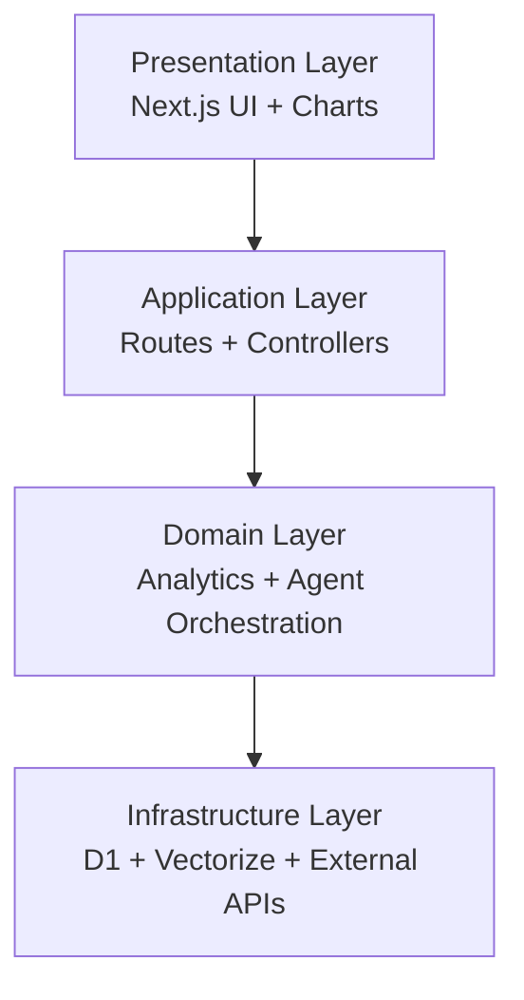
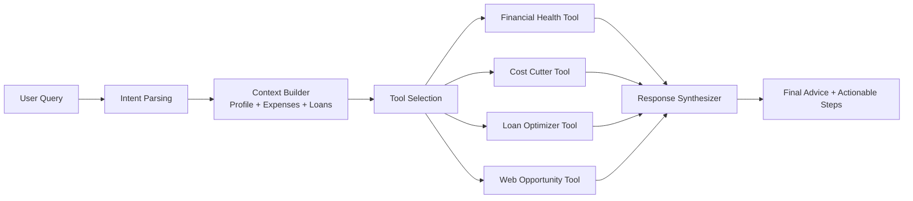
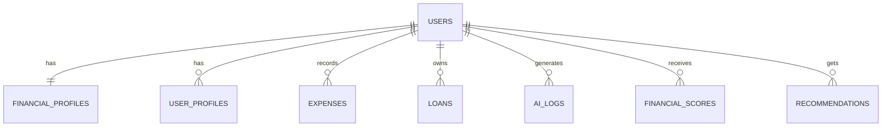
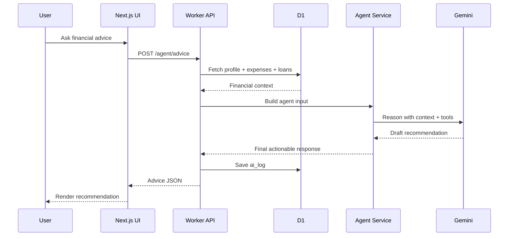
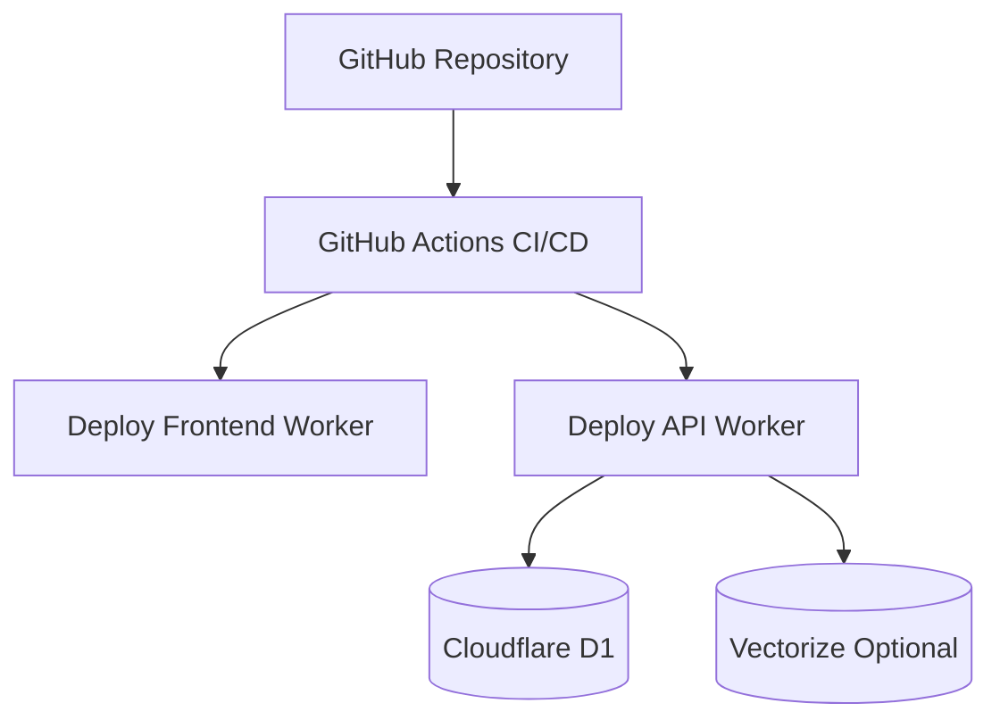
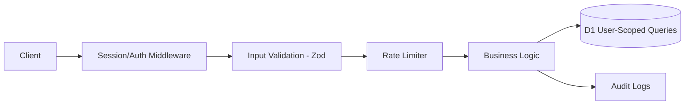

# BurryAI - University Project Explanation

This document is written for final-year project presentation, report writing, and viva discussion.

---

## 1) Project Overview (University POV)

### Project Title
**BurryAI: Agentic AI Financial Advisor for Students**

### Problem Statement
Students often struggle with budgeting, debt tracking, and cash-flow planning. Existing tools usually provide only dashboards, not personalized decision support. Users still have to manually interpret charts and decide actions.

### Proposed Solution
BurryAI combines:
- financial data tracking (income, expenses, loans),
- deterministic financial analytics,
- and an agentic AI advisor pipeline

to generate personalized, explainable recommendations for spending optimization and financial planning.

### Target Users
- college/university students
- first-time earners
- users with beginner-level financial literacy

---

## 2) System Architecture (Macro View)

### Explanation
- Frontend handles user interaction and visualization.
- Worker API serves as the business-logic boundary.
- D1 stores persistent financial data.
- Agent service combines model reasoning with tools and context.
- Optional retrieval modules improve grounding and freshness.

---

## 3) Layered Architecture

### Why this architecture matters
- separation of concerns
- easier testing and maintenance
- each layer can evolve independently

---

## 4) Agentic AI Architecture (Core Innovation)

### Academic value
- This is an **agentic pipeline**, not a single prompt.
- Decision quality improves because responses are based on:
  - structured user context,
  - deterministic tool outputs,
  - and optional retrieval support.

### Comparison vs standard chatbot
- Standard chatbot: prompt -> model -> answer
- BurryAI: query -> orchestration -> tools/retrieval -> synthesized recommendation

---

## 5) Data Architecture (D1 Schema View)

### Key Entities
- `users`: account identity and credentials
- `financial_profiles`: monthly income, goals, risk context
- `user_profiles`: onboarding and user-level metadata
- `expenses`, `loans`: core financial transaction context
- `ai_logs`: AI traceability and research/audit value

---

## 6) Runtime Request Flow (Sequence View)

---

## 7) Deployment Architecture (Cloudflare Native)

### Benefits
- edge deployment for lower latency
- unified platform for frontend + backend + DB
- reproducible migrations and CI-based releases

---

## 8) Security and Trust Architecture

### Security controls
- session-based auth and protected routes
- schema validation for request payloads
- route-level rate limiting
- user-scoped SQL access to prevent data leakage
- AI interaction logging for observability

---

## 9) Methodology (Suggested Report Section)

### Approach
1. Requirements analysis (student pain points)
2. UI-first prototyping for user flows
3. Backend API and D1 schema implementation
4. Deterministic analytics engine development
5. Agentic AI orchestration integration
6. Iterative testing and deployment hardening

### Software Engineering Practices
- modular feature development
- migration-driven database evolution
- reusable API contracts
- production-minded deployment and monitoring

---

## 10) Novelty and Contribution

- Integrates deterministic finance calculations with agentic AI decision support.
- Builds an explainable recommendation pipeline instead of black-box chat-only responses.
- Targets student finance specifically, where contextual advice has high social relevance.
- Demonstrates practical edge-native architecture using Cloudflare services.

---

## 11) Expected Outcomes / Evaluation Points

For university assessment, you can evaluate:
- **Functional accuracy**: correctness of dashboard metrics vs manual calculations
- **Recommendation quality**: relevance and actionability of AI suggestions
- **Latency**: API response times under normal load
- **Usability**: student feedback on clarity and usefulness
- **Reliability**: behavior under failed AI/provider calls (fallback handling)

---

## 12) Limitations (Honest Discussion)

- Financial suggestions are educational guidance, not certified investment advice.
- Recommendation quality depends on data completeness and user honesty.
- Web retrieval quality depends on external provider availability and freshness.
- Current version focuses on individual budgeting; not full portfolio management.

---

## 13) Future Scope

- predictive expense forecasting
- anomaly/spike detection alerts
- deeper debt repayment simulation models
- multilingual advisor responses
- institution-specific student finance datasets

---

## 14) Viva-Ready Short Pitch (60-90 seconds)

BurryAI is a student-focused financial advisory platform that combines analytics and agentic AI. Instead of only showing charts, it converts financial data into actionable decisions. The architecture uses a Next.js frontend, a Cloudflare Worker backend, a D1 database, and an AI agent pipeline that retrieves user context, invokes financial tools, and synthesizes recommendations. This design improves explainability and practical usefulness compared to basic chatbot solutions, while maintaining scalability and low-latency deployment on edge infrastructure.

---

## 15) Quick Q&A (For Viva)

**Q: What makes this project AI-agentic and not just chatbot-based?**  
A: It uses orchestration steps and tool calls (health score, cost-cutting, loan optimization) before generating final advice.

**Q: Why use deterministic analytics with AI?**  
A: Deterministic metrics improve trust and reduce hallucinated numerical outputs.

**Q: Why Cloudflare stack?**  
A: Unified deployment model for frontend, API, and data with edge performance.

**Q: How is data privacy handled?**  
A: Session auth, protected routes, user-scoped queries, and secret management on backend only.

